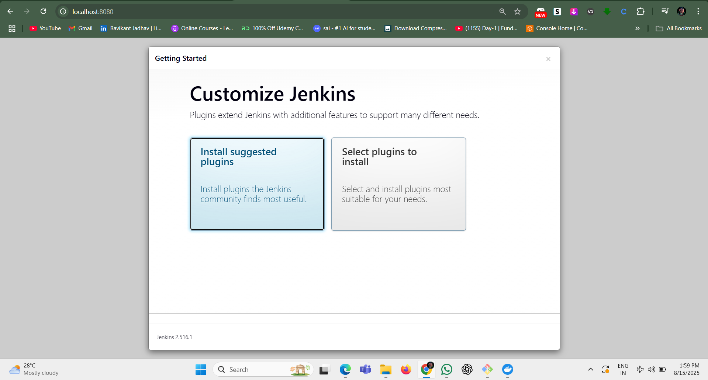
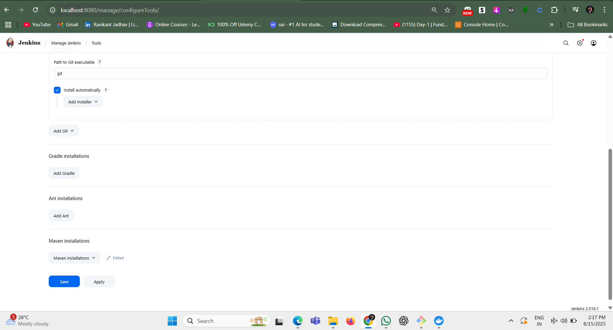
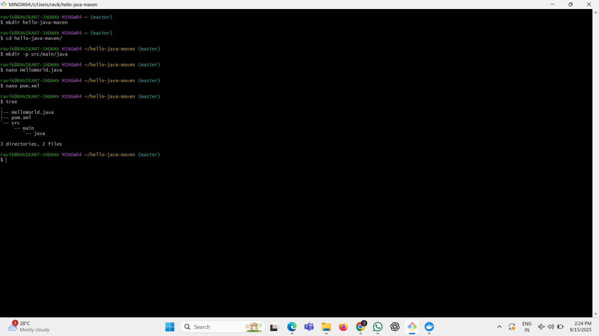
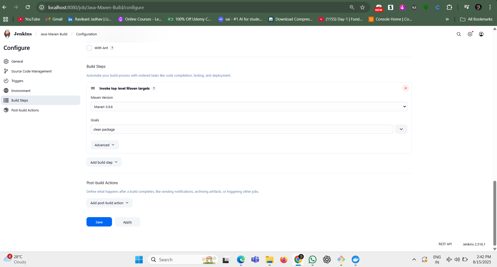
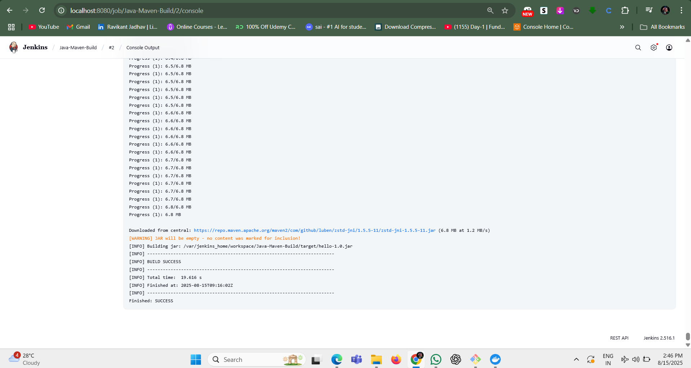

# 🚀 Jenkins Maven Build Project

## 📌 Overview
This project demonstrates how to run a simple **Java Maven build job** in **Jenkins** using Docker.  
It’s a beginner-friendly example for learning **Continuous Integration (CI)** with Jenkins.

---

## 🛠 Tools & Technologies Used
- **Jenkins LTS** (run in Docker)
- **Maven 3.9.6** (configured in Jenkins)
- **Java 8**
- **Docker**

---

## 📂 Project Structure
hello-java-maven/
│── pom.xml
│── README.md
│── screenshots/
│ ├── docker-ps.png
│ ├── jenkins-setup-screen.png
│ ├── maven-tool-configuration.png
│ ├── folder-structure.png
│ ├── build-configuration-in-jenkins.png
│ ├── build-sucess.png
│── src/
│ └── main/
│ └── java/
│ └── HelloWorld.java

- **HelloWorld.java** → Prints `"Hello, Jenkins + Maven!"`
- **pom.xml** → Maven build configuration

---

## 🧭 Step-by-Step Guide

### **1️⃣ Start Jenkins in Docker**
```bash
docker pull jenkins/jenkins:lts
docker run -d \
  --name jenkins \
  -p 8080:8080 \
  -p 50000:50000 \
  -v jenkins_home:/var/jenkins_home \
  jenkins/jenkins:lts
```

📸 Screenshot:


2️⃣ Unlock Jenkins & Initial Setup

Go to http://localhost:8080

Copy admin password from Docker logs:

```bash
docker logs jenkins
```

Complete setup wizard and install suggested plugins.

📸 Screenshot:



3️⃣ Configure Maven in Jenkins

Go to Manage Jenkins → Global Tool Configuration

Add Maven:

Name: Maven-3.9.6

Tick Install automatically

Save settings.

📸 Screenshot:



4️⃣ Create the Java Project

Create folder structure:

```bash
mkdir -p src/main/java
```

Add HelloWorld.java:

```java
public class HelloWorld {
    public static void main(String[] args) {
        System.out.println("Hello, Jenkins + Maven!");
    }
}
```

Add pom.xml:

```xml
<project xmlns="http://maven.apache.org/POM/4.0.0"
         xmlns:xsi="http://www.w3.org/2001/XMLSchema-instance"
         xsi:schemaLocation="http://maven.apache.org/POM/4.0.0
                             http://maven.apache.org/xsd/maven-4.0.0.xsd">

    <modelVersion>4.0.0</modelVersion>
    <groupId>com.example</groupId>
    <artifactId>hello</artifactId>
    <version>1.0</version>

    <properties>
        <maven.compiler.source>1.8</maven.compiler.source>
        <maven.compiler.target>1.8</maven.compiler.target>
    </properties>

    <build>
        <plugins>
            <plugin>
                <groupId>org.apache.maven.plugins</groupId>
                <artifactId>maven-compiler-plugin</artifactId>
                <version>3.8.1</version>
                <configuration>
                    <source>${maven.compiler.source}</source>
                    <target>${maven.compiler.target}</target>
                </configuration>
            </plugin>
        </plugins>
    </build>

</project>
```

📸 Screenshot:



5️⃣ Create Jenkins Freestyle Job

In Jenkins dashboard → New Item

Name: Java-Maven-Build

Select Freestyle Project

In Source Code Management:

Select Git and add repo URL (e.g., https://github.com/YOUR_USERNAME/hello-java-maven.git)

Credentials: Add your GitHub credentials if required.

In Build:

Add Build Step → Invoke top-level Maven targets

Maven Version: Maven-3.9.6

Goals: clean package

Save job.

📸 Screenshot:



6️⃣ Build the Job

Click Build Now

Open Console Output → Look for:

``` nginx
BUILD SUCCESS
```

📸 Screenshot:



🎯 What You Learn from This Project

How to run Jenkins in Docker

How to configure Maven inside Jenkins

How to create a Freestyle job for a Java project

How to read Jenkins build logs

Basic CI/CD concepts in practice
